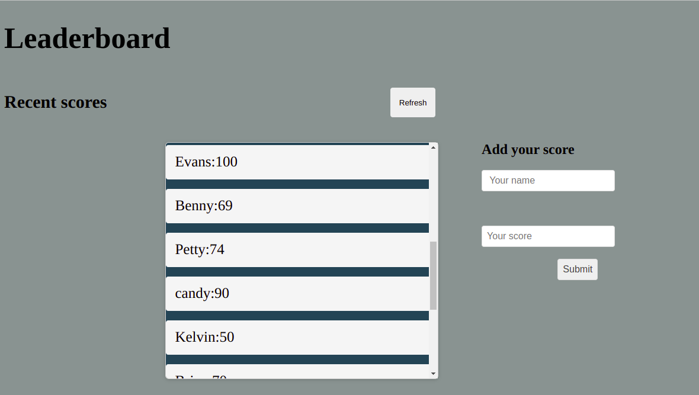

## Learderboard

"The leader-board website displays scores submitted by different players. It allows you submit your scores. Built with JavaScript and APIs

> Below is how the website should look and behave                                                                                                         |
> | --------------------------------------------------------------------------------------------------------------------- |
> |  |

> Learning objectives:

- Use webpack to bundle JavaScript.
- Use ES6 modules to write modular JavaScript.
- Learn how to use proper ES6 syntax
- Use callbacks and promises

## LIVE DEMO

[Live Demo Link]()


## Built With

- HTML
- CSS
- Java Script
- Webpack


### Setup

### Clone this repository
```bash
$ git clone https://github.com/evans22j/Leaderboard.git
$ cd leaderboard
```


### Set up Webpack
```bash

$ npm install --save-dev html-webpack-plugin
$ npm install --save-dev webpack-dev-server
$ npm npm install --save-dev style-loader css-loader # To able to use npm run start for live reloading.
```


### Run project
```bash
$ npm install
$ npm run build
$ npm run start # this will make webpack watching for your changes in code.
```


### open the page in the browser
```bash
$ open dist/index.html
```


## Test

- For tracking the linter errors in HTML file run:

  > npx hint .

- For tracking the linter errors in CSS file run:

  > npx stylelint "\*_/_.{css,scss}"

  - And For tracking the linter errors in JavaScript file run:

    > npx eslint .

  

## Author

👤 **Evans Sitibekiso**

- [GitHub](https://github.com/evans22j)
- [Twitter](https://twitter.com/Evans_22J)
- [LinkedIn](https://www.linkedin.com/in/evans-sitibekiso-a85753202/)

## 🤝 Contributing

Contributions, issues, and feature requests are welcome!

Feel free to check the [issues page](../../issues/).

## Show your support

Give a ⭐️ if you like this project!

## Acknowledgments

- Huge thanks to microverse for this project
